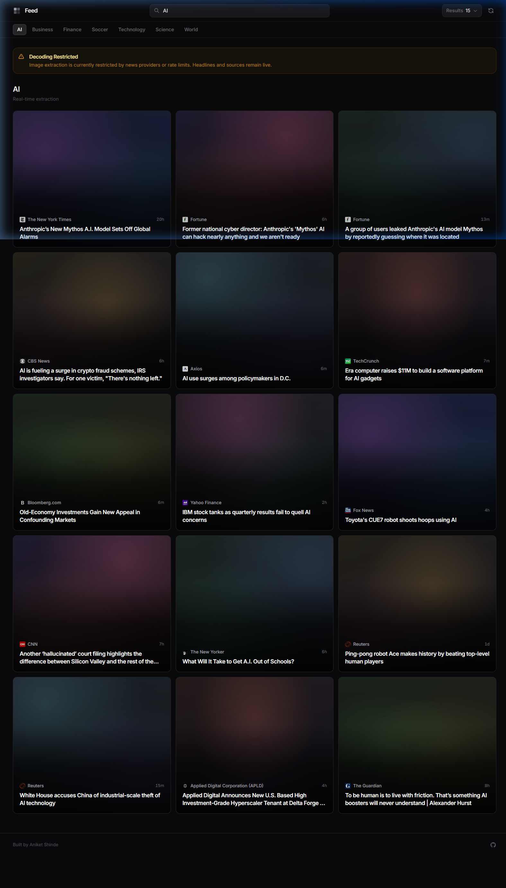
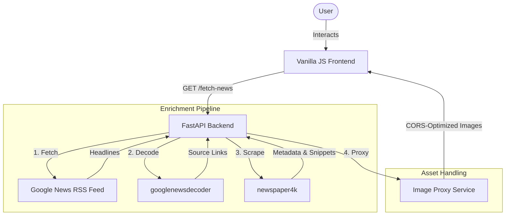

# Feed: Real-Time News Aggregator


Feed is a high-performance news aggregation platform that delivers a consolidated, enriched viewing experience from multiple global sources. By integrating real-time RSS processing with advanced metadata extraction and URL resolution, Feed provides a clean, unified interface for information consumption without the clutter of traditional news portals.



## System Architecture

The following diagram illustrates the data flow and system components:



## Key Capabilities

*   **Asynchronous Aggregation**: Headlines are retrieved and processed in parallel using Python's `concurrent.futures`, ensuring minimal latency even during heavy enrichment tasks.
*   **Deep Metadata Extraction**: Leverages `newspaper4k` to perform forensic scraping of article pages, extracting hero images and relevant text snippets for a rich preview experience.
*   **Smart URL Resolution**: Resolves obfuscated news redirect links into original publisher URLs in real-time, bypassing middleman tracking and improving link transparency.
*   **Intelligent Image Proxying**: A built-in proxy service handles external image requests, overcoming CORS limitations and ensuring consistent asset availability across all publishers.
*   **Dynamic UI Theming**: The frontend implements a color-extraction algorithm that adapts the application's visual theme based on the dominant palette of the featured news content.

## Getting Started

### Prerequisites

*   Python 3.11 or higher
*   A stable internet connection for real-time scraping

### Installation

1.  **Clone the repository**:
    ```bash
    git clone https://github.com/aniketqxp/simple-news-aggregator.git
    cd simple-news-aggregator
    ```

2.  **Initialize the environment**:
    ```bash
    python -m venv venv
    # Windows
    venv\Scripts\activate
    # macOS/Linux
    source venv/bin/activate
    ```

3.  **Install dependencies**:
    ```bash
    pip install -r requirements.txt
    ```

### Quick Start

Launch the server using the root entry point:

```bash
python main.py
```

The application will be available at `http://127.0.0.1:8000`.

## Project Structure

```text
├── src/
│   ├── api/            # API endpoints and route logic
│   ├── core/           # Configuration and application settings
│   ├── models/         # Pydantic schemas for data validation
│   ├── services/       # RSS fetching, URL decoding, and scraping logic
│   └── main.py         # Application core and static file orchestration
├── static/
│   ├── assets/         # UI screenshots and static assets
│   ├── css/            # Custom application styles
│   ├── js/             # Frontend application logic
│   └── index.html      # Main HTML entry point
├── tests/              # Pytest-based integration tests
├── .gitignore
├── pyproject.toml
├── requirements.txt
├── main.py             # Root entry point
└── README.md
```

## License

This project is licensed under the MIT License - see the [LICENSE](LICENSE) file for details.
